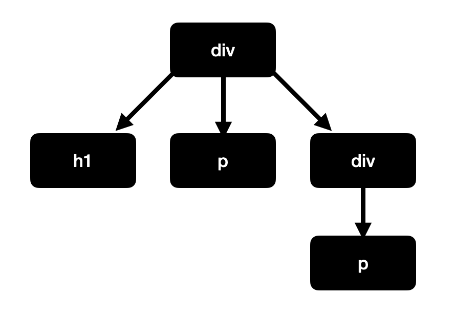

## Schedule
- Go over [Assignment 1: GitHub Pages](https://docs.google.com/document/d/1AAQUWTkmmfpsm4GZiPIw75B1lA6tmktn8SNO6CZ8Yxo/edit?usp=sharing)
- CSS Animation
- Embedded Content
- Introduce Assignment 2: Recreate Poster Layout

## Homework
- Continue working on Project 1
- Assignment 2: Recreate Poster Layout

## Typography

### Web Fonts
Addition way to access Google Fonts by directly connect to your web page:

1. Select your styles on [Google Fonts](https://fonts.google.com/)
2. See selected families
3. Copy the generated code into `<head>` of your HTML file
4. Use the `font-family` property to apply to HTML text elements.

### Viewport Units

Viewport units in CSS are units of measurement that are based on the size of the viewport, or the visible area of a web page. They allow developers to create responsive designs that adjust to the size of the screen or window being used to view the page.


## CSS Selectors

### Selector Combinations
To select multiple elements, separate the selectors by commas, like so:
```css
h1, p {
    border: 1px solid black;
}
```

### Selecting Nested Elements
Example:
```html
<div>
  <h1>Selecting Nested Elements with CSS</h1>
  <p>We can specify to only style elements within this div.</p>

  <div>
    <p>Elements can have any level of nesting and still be selected correctly.</p>
  </div>

</div>
```
In this HTML example, there is a `div` (the parent element) that has three children elements. The nested `div` also contains a single child. It creates a tree-like structure:



To select for only the children of a certain parent element, you must indicate the parent element and then the child element, with a `>` bracket in between them.

```css
div > h1 {
  border-bottom: 1px solid black;
}

div > div > p {
  border-bottom: 1px solid black;
}
```

## CSS Animation

### Intro to CSS Animation
- CSS animations allow you to add dynamic and interactive effects to your website using only CSS.
- CSS animations are a simple way to create dynamic effects without the need for JavaScript.
- Animations can be used to create smooth transitions, add visual interest, and improve the overall user experience.

### Keyframes
- Keyframes are the foundation of CSS animations.
- Keyframes define the starting and ending state of an animation, as well as any intermediate steps.
- To create a keyframe animation, you define the starting and ending styles using a set of keyframes.
- [@keyframe on MDN](https://developer.mozilla.org/en-US/docs/Web/CSS/@keyframes)

```css
@keyframes example {
    from {
        transform: scale(1);
    }
    to {
        transform: scale(1.5);
    }
}
```

- The `scale()` CSS function defines a transformation that resizes an element on the 2D plane. 
- It is specified with either one or two values, which represent the amount of scaling to be applied in each direction.
- Inside the keyframes rule, from and to are keywords that represent 0% and 100%, which are the start of the animation and end. You could re-create the same rule like this:

```css
@keyframes example {
	0% {
		transform: scale(1);
	}
	100% {
		transform: scale(1.5);
	}
}
```

Another example:

```html
<body class="box"></div>
```

```css
/* Define the keyframes */
@keyframes another-example {
  from {background-color: #4CAF50;}
  to {background-color: #008CBA;}
}

/* Apply the animation to a specific element */
.box {
  animation-name: another-example;
  animation-duration: 4s;
  animation-iteration-count: infinite;
}
```

### CSS Animation Properties

1. `animation-name`

- specifies the names of one or more `@keyframes` at-rules that describe the animation to apply to an element.
- Common value: `none` which is a special keyword denoting no keyframes. It can be used to deactivate an animation without changing the ordering of the other identifiers, or to deactivate animations coming from the cascade.
- It can also be a user customized identifier. This identifier is composed of a combination of case-sensitive letters a to z, numbers 0 to 9, underscores (_), and/or dashes (-). The first non-dash character must be a letter. Also, two dashes are forbidden at the beginning of the identifier. Furthermore, the identifier can't be none, unset, initial, or inherit.
- [https://developer.mozilla.org/en-US/docs/Web/CSS/animation-name](https://developer.mozilla.org/en-US/docs/Web/CSS/animation-name)


2. `animation-duration`
- Defines how long the `@keyframes` timeline should be.
- It should be a time value. It defaults to 0 seconds, which means the animation still runs, but it'll be too quick for you to see.
- It can't take negative time values.

    ```css
    .my-div {
        animation-duration: 10s;
    }
    ```

3. `animation-timing-function`
- To help recreate natural motion in animation
- It uses timing functions that calculate the speed of an animation at each point.
- Common values include: `linear`, `ease`, `ease-in`, `ease-out`, `ease-in-out`
- *[Cubic Bezier](https://cubic-bezier.com/#0,0,1,1)
- [https://developer.mozilla.org/en-US/docs/Web/CSS/animation-timing-function](https://developer.mozilla.org/en-US/docs/Web/CSS/animation-timing-function)

4. `animation-delay`

- It takes a `<time>` value, the time offset, from the moment at which the animation is applied to the element, at which the animation should begin.

- It may be specified in either seconds (s) or milliseconds (ms). The unit is required.

- Negative value will starts the animation immediately.

-[https://developer.mozilla.org/en-US/docs/Web/CSS/animation-delay](https://developer.mozilla.org/en-US/docs/Web/CSS/animation-delay)

5. `animation-iteration-count`

- It sets the number of times an animation sequence should be played before stopping.

- Common value: `infinite` - the animation will repeat forever.

- `<number>` - The number of times the animation will repeat; this is 1 by default. You may specify non-integer values to play part of an animation cycle: for example, 0.5 will play half of the animation cycle. Negative values are invalid.

- [https://developer.mozilla.org/en-US/docs/Web/CSS/animation-iteration-count](https://developer.mozilla.org/en-US/docs/Web/CSS/animation-iteration-count) 


6. `animation-direction`

- Sets whether an animation should play forward, backward, or alternate back and forth between playing the sequence forward and backward.

- `normal`: The animation plays forward.
- `reverse`: The animation plays backward.
- `alternate`: The animation plays forward then backward.
- `alternate-reverse`: The animation plays backward then forward.

## Embedded Content

### Image `` 

The `` tag in HTML is used to embed images in web pages. It has a required "src" attribute which specifies the URL of the image to be displayed. Some other commonly used attributes include "alt" (alternative text description of the image), "width" and "height" (dimensions of the image), and "title" (tooltip text displayed on hover). The `` tag does not have a closing tag and is an empty element, meaning it does not have any content between the opening and closing tags.

```html

```

Supported image file formats: 
- APNG (Animated Portable Network Graphics) is a file format first introduced by Mozilla which extends the PNG standard to add support for animated images.
- AVIF (AV1 Image File Format) is a powerful, open source, royalty-free file format that encodes AV1 bitstreams in the High Efficiency Image File Format (HEIF) container.
- BMP (Bitmap File): most prevalent on Windows computers, and is generally used only for special cases in web apps and content.
- GIF (Graphics Interchange Format) supports simple animation, in which following an initial full-size frame, a series of images reflecting the parts of the image that change with each frame are provided
- JPEG (Joint Photographic Experts Group image) : most widely used lossy compression format for still images.
- PNG (Portable Network Graphics, pronounced "ping"): uses lossless compression, while supporting higher color depths than GIF and being more efficient, as well as featuring full alpha transparency support.
- SVG (Scalable Vector Graphics) specifies the contents of an image as a set of drawing commands that create shapes, lines, apply colors, filters, and so forth.
- WebP supports lossy compression via predictive coding based on the VP8 video codec, and lossless compression that uses substitutions for repeating data.

### Videos `<video>` and YouTube / Vimeo

`<video>` tag in HTML is used to embed video content within a webpage. It is an HTML5 element and is a container for video files and audio content. 

`<video>` tag supports several video file formats including MP4, WebM, and Ogg. The tag can be customized with various attributes such as width, height, autoplay, loop, and controls to define the appearance and behavior of the embedded video.


### Audio `<audio>` 

- to embed sound content in documents.

```html
<!-- Simple audio playback -->
<audio src="AudioTest.mp3" autoplay>
  <a href="AudioTest.mp3">Download MP3 audio</a>.
</audio>
```

### Iframes

`<iframe>` represents a nested browsing context, embedding another HTML page into the current one.

The src attribute is used to specify the URL of the embedded content and the width and height attributes are used to specify the size of the frame.

